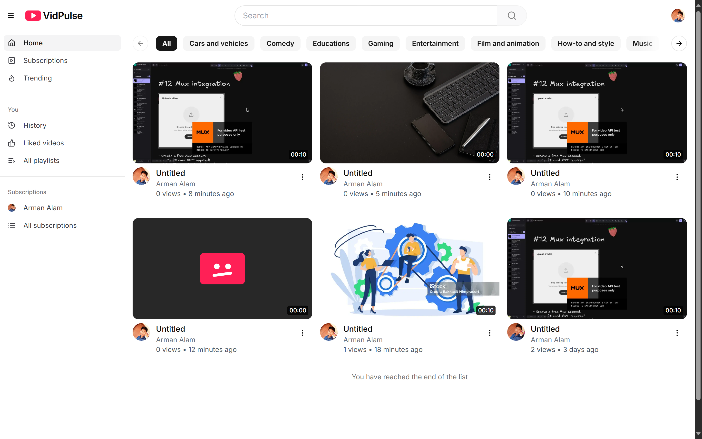
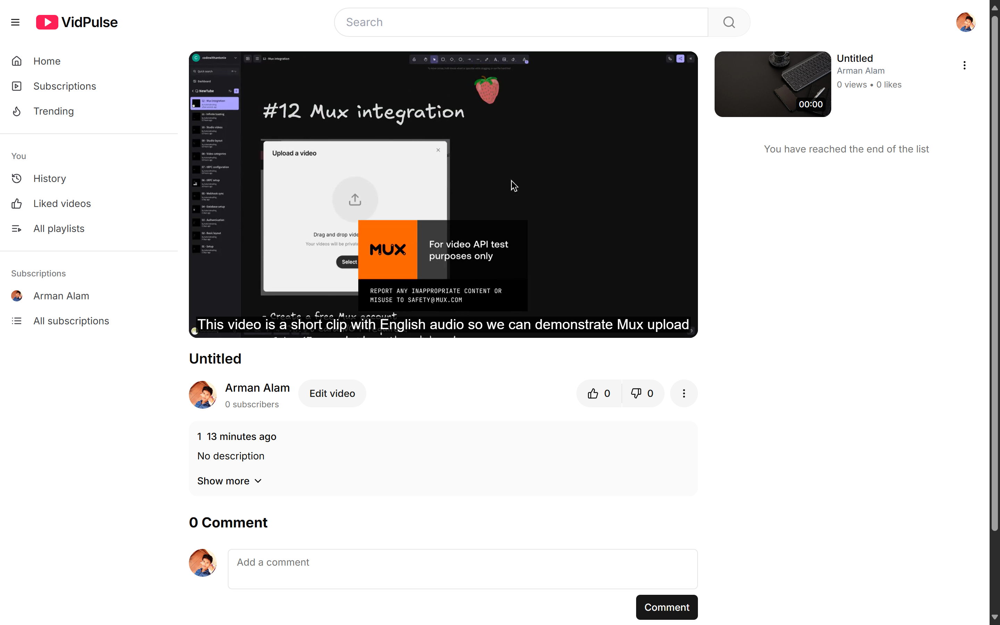
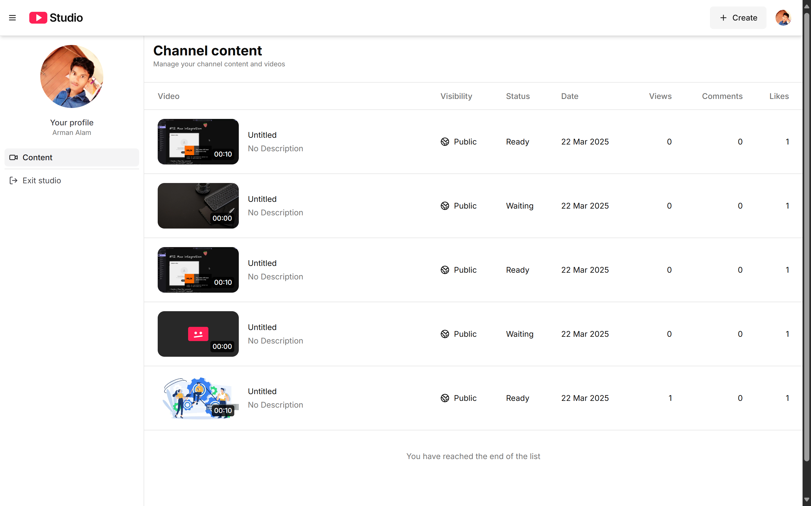
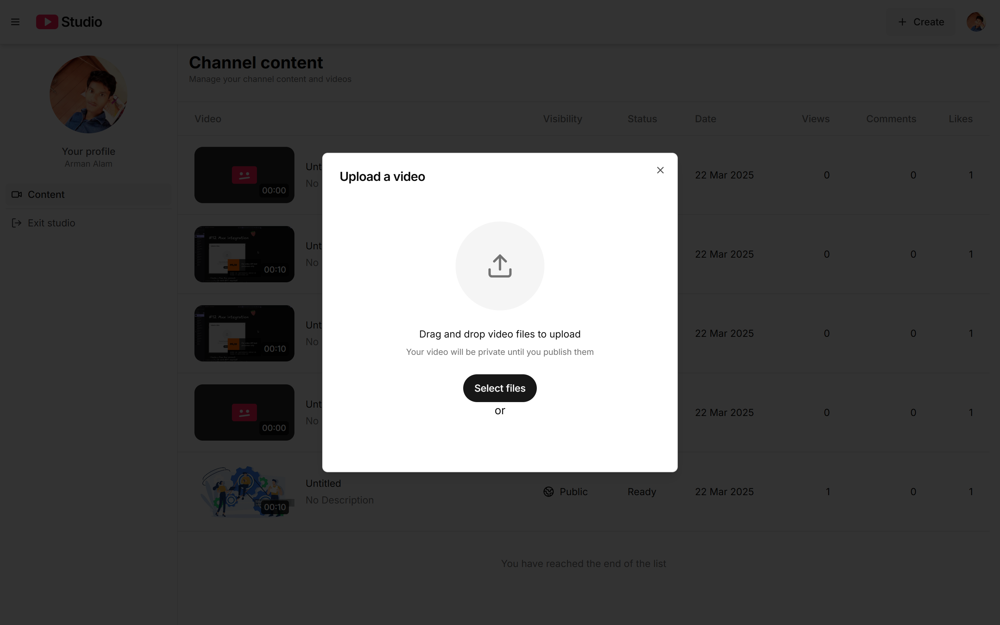
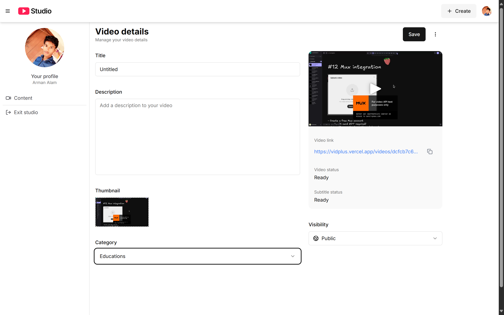
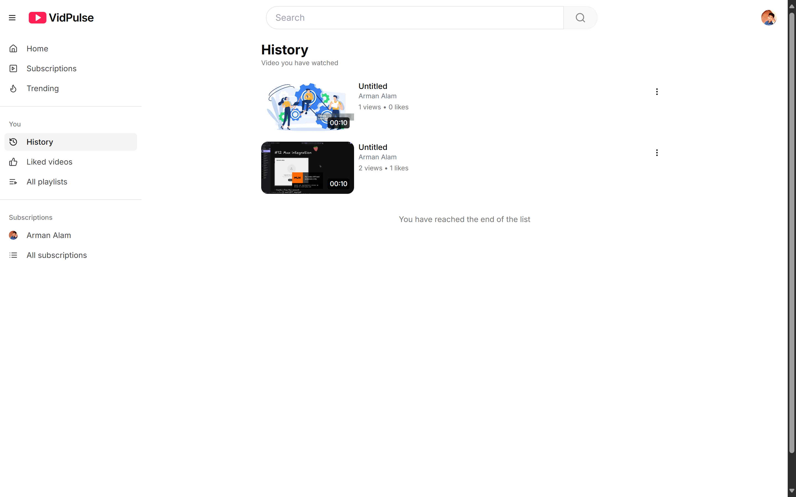
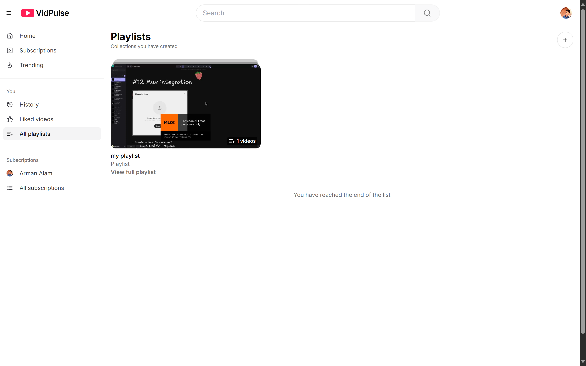
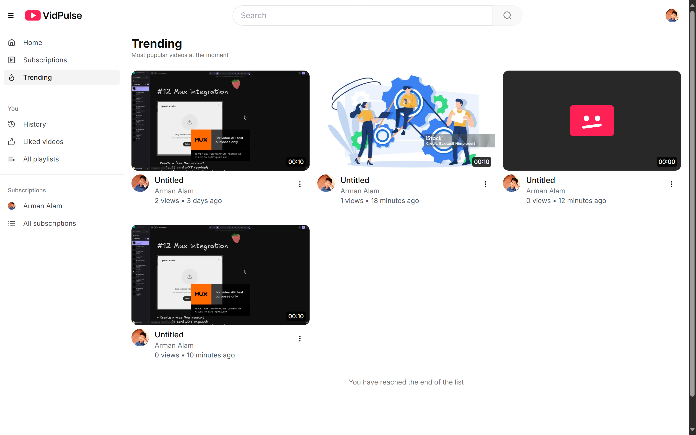
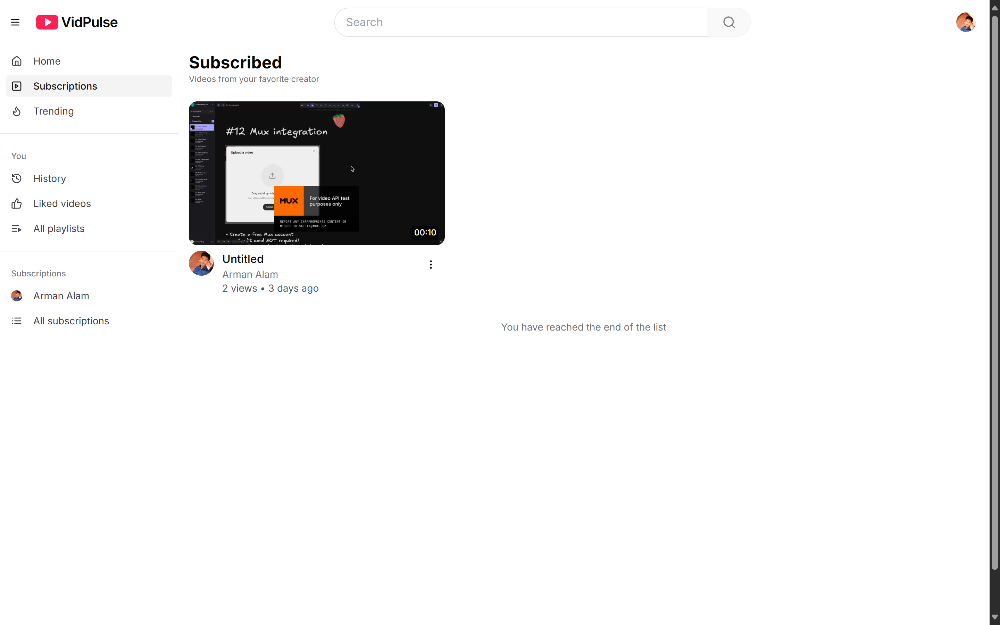
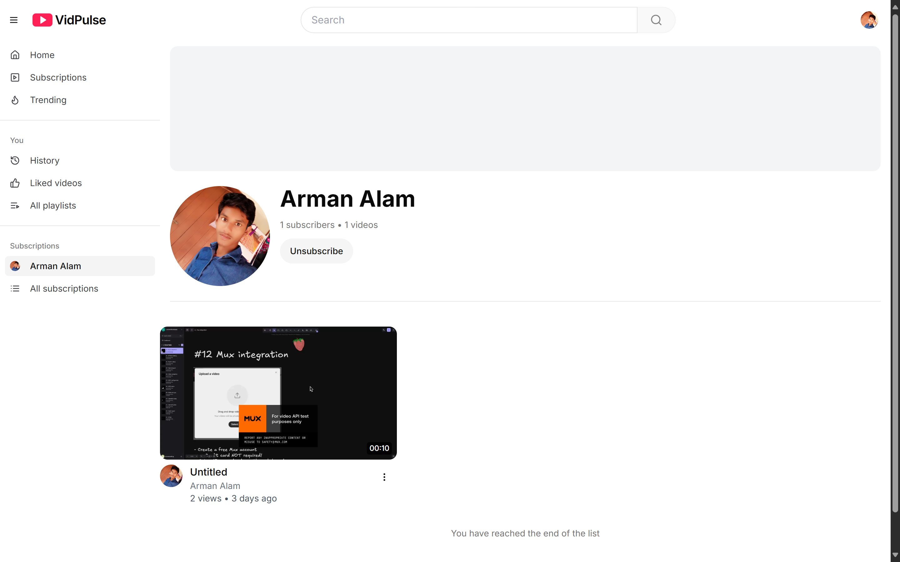

## 📱 Core Pages & Feature Breakdown

### 1. Consumer Discovery Feed (`/`)
The homepage acts as an entry point for content discovery, organizing uploads into responsive thumbnail grids.
* **Smart Filter Pillars:** Implements tag rows allowing users to switch dynamically between video classifications (e.g., `All`, `Educations`, `Gaming`, `Comedy`).
* **Hover-Ready Cards:** Renders complete card states displaying titles, asset creator avatars, rolling upload intervals, and accurate aggregate view logs.

🖼️ **Interface View:**



---

### 2. Multi-Format Video Player Interface (`/videos/[id]`)
An immersive media watch screen built around a feature-rich custom media player asset layer.
* **Mux Stream Player Integration:** High-efficiency player managing continuous playback alongside automated caption generation tracks.
* **Social Engagement Anchors:** Features explicit interactive options like upvote/downvote tracking, comment logs, and customized creator edit paths for file owners.
* **Up Next Sidebar:** Dynamically renders contextually relevant recommendation side-feeds to keep users engaged.

🖼️ **Interface View:**


---

### 3. Comprehensive Creator Studio Dashboard (`/studio/content`)
An isolated workspace for channels to securely audit and organize their complete publication list.
* **Master Inventory Matrix:** Displays data rows tracking individual uploads, release status, publication dates, and viewing performance metrics.
* **Real-Time Transcoding Tracks:** Surfaces explicit system flags (`Ready`, `Waiting`, `Processing`) reflecting cloud backend rendering states.

🖼️ **Interface View:**


---

### 4. Interactive Asynchronous File Upload Interface
An elegant modal workspace managing seamless local file ingestion.
* **Drag-and-Drop Dropzone Engine:** Allows creators to drag video files or select them using local system file explorers.
* **Instant Processing Invalidation:** Safely pushes uploaded file chunks to background storage while creating private placeholder rows in the database.

🖼️ **Interface View:**


---

### 5. Content Metadata Customization Hub
A dedicated workspace for creators to fine-tune and optimize video metadata before going public.
* **Asset Enrichment Forms:** Managed input layers tracking titles, comprehensive descriptions, text category selections, and custom visibility toggles (`Public`/`Private`).
* **Automated Asset Extraction:** Showcases generated video link parameters along with automatic thumbnail extractions processed directly via Mux.

🖼️ **Interface View:**


---

### 6. Curated Watch History & User Personalization
A personalized historical archive tracking a user's recent watch history.
* **Persistent Session Auditing:** Automatically appends an entry to a user's account whenever a stream is viewed.
* **Linear Time Tracking:** Organizes watched videos linearly so users can easily pick up where they left off.

🖼️ **Interface View:**


---

### 7. Playlist Creation Portfolio (`/playlists`)
An organization layer that empowers consumers to group technical guides, music, or entertainment into organized folders.
* **Aggregated Media Collections:** Collects distinct clips inside a single playlist asset component.
* **Dynamic Content Counters:** Automatically tracks total video volume stats inside the preview thumbnail card layout.

🖼️ **Interface View:**


---

### 8. Dynamic Trending Engine (`/trending`)
A dedicated content feed optimized to highlight popular uploads across the network.
* **Velocity Metrics Processing:** Surfaces video tiles that are gaining view traction within the platform.
* **Frictionless View Upgrades:** Instantly elevates emerging creator channels on a dedicated discovery page.

🖼️ **Interface View:**


---

### 9. Subscriptions Feed Portfolio (`/subscriptions`)
A personalized chronological feed compiling updates exclusively from creators a user follows.
* **Filtered Feed Invalidation:** Filters out un-followed records entirely to create an intimate user feed.
* **Subscription Status Cards:** Integrates with creator channels to easily subscribe or unsubscribe with a single click.

🖼️ **Interface View:**
 | 

---

## 🛠️ Complete Technical Stack Architecture

| Layer | Selected Technology | Structural Purpose |
| :--- | :--- | :--- |
| **Framework Base** | `Next.js 14+ (App Router)` | Next-gen page routing, server components for faster loads, and optimized asset caching. |
| **Media Delivery** | `Mux Video API` | Handles cloud video transcoding, automated subtitle generation, and low-latency HLS streaming. |
| **Styling Engine** | `Tailwind CSS` | Utility-first UI styling with fully responsive grid layouts tailored for streaming interfaces. |
| **Authentication Core**| `Clerk Auth / Custom Identity` | Manages creator profile validation and securely isolates Studio access. |

---

## 📂 Core Directory Structure

* **`vidpulse/`** — Project root workspace
  * **`app/`** — Next.js App Router root layout and pages
    * **`(root)/`** — Consumer portal layout group
      * **`history/`** — User watch history feed tracking
      * **`playlists/`** — User-curated custom playlist folders
      * **`trending/`** — High-velocity popular video analytics feed
      * **`videos/`** — Dynamic watch page housing the core streaming player
    * **`studio/`** — Isolated creator dashboard layouts
      * **`content/`** — Inventory matrix tracking a channel's overall portfolio
      * **`upload/`** — Drag-and-drop video processing pipelines
    * **`layout.tsx`** — Root layout wrapper and provider injections
    * **`globals.css`** — Shared style architecture overrides
  * **`components/`** — Modular application design tokens
    * **`shared/`** — Core layout features (`Navbar`, persistent sidebars)
    * **`ui/`** — Base primitives (`Buttons`, interactive form blocks, grids)
  * **`public/`** — Local asset storage for icons and vector graphics
  * **`package.json`** — Script shortcuts and core dependencies listing

---

## ⚙️ Local Workspace Initialization

Follow these simple steps to spin up a production-grade instance of the platform in your local workspace:

1. **Clone the Project Repository:**
   ```bash
   git clone [https://github.com/your-username/vidpulse.git](https://github.com/Mr-armanalam/vidpulse.git)
   cd vidpulse